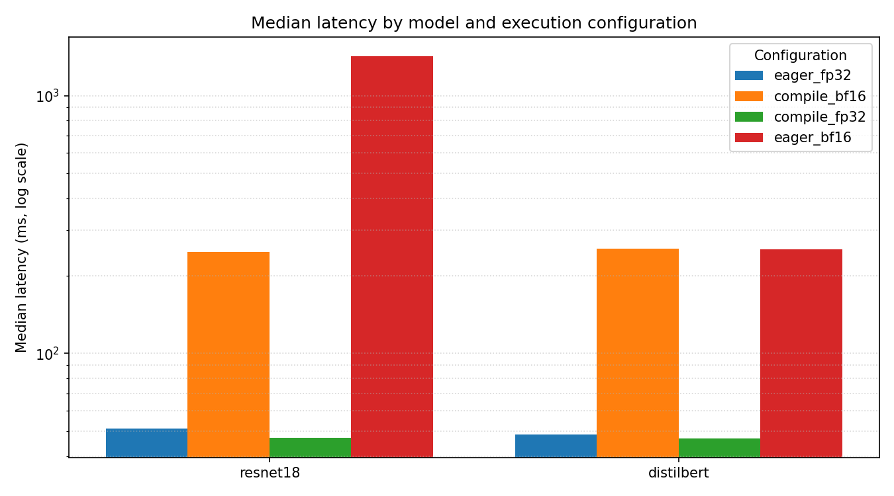

# ml-regression-watch

Benchmarking, numerical validation, and CI regression detection for ML models across
execution configurations.

`ml-regression-watch` is a small pytest-based harness that benchmarks reference models
under several execution configurations, validates that reduced-precision and compiled
configurations remain numerically faithful to a full-precision baseline, and detects
performance regressions in continuous integration using a statistical test rather than
a fixed threshold.

## Motivation

A model that runs faster but returns different numbers is not the same model, and a
configuration that is correct today can regress tomorrow without anyone noticing. Both
problems are problems of evaluation: deciding, with evidence, whether two runs agree.

This project continues a line of work by the author on the evaluation and
reproducibility of machine learning systems. DAPPER is a published framework for
assessing the reproducibility of AI algorithms in digital pathology, and the Data
Analysis Plan framework developed with the MAQC Consortium and the United States Food
and Drug Administration codified how predictive analyses should be specified in advance
so that their results can be trusted. The same principles apply here at the level of the
software stack: state the comparison, fix the inputs, quantify the divergence, and test
for regressions with a defined statistical procedure.

The harness targets the questions a machine learning quality team asks of an
accelerated software stack:

- Does a compiled or reduced-precision configuration still produce the right answer,
  and by how much does it diverge when it does not?
- Is the current build slower than the established baseline, and is that slowdown real
  or within measurement noise?

## Quickstart

```bash
python -m venv .venv && source .venv/bin/activate
pip install -e ".[dev]"

# Benchmark the reference models across the configuration matrix.
mlrw run --out artifacts/run.json --device auto

# Validate numerical correctness against the fp32 eager baseline.
mlrw validate artifacts/run.json --report reports/validation.md

# Detect performance regressions against a stored baseline.
mlrw compare --baseline baselines/cpu_ci.json --current artifacts/run.json \
  --report reports/regression.md

# Promote a run to the stored baseline.
mlrw update-baseline --from artifacts/run.json --out baselines/cpu_ci.json
```

The harness runs on CPU by default and uses CUDA automatically when a device is
visible. `--device auto` resolves to the available device; `cpu` and `cuda` force a
specific device.

## Reference models and configurations

Two reference models exercise distinct compute profiles: a torchvision **ResNet-18**
(convolutional, vision) and a Hugging Face **DistilBERT** (transformer, text). Inputs
are generated from fixed seeds so that every run compares like with like.

Each model is benchmarked across the matrix of execution modes and precisions:

| Mode    | Precision | Configuration name |
| ---     | ---       | ---                |
| eager   | fp32      | `eager_fp32` (baseline) |
| eager   | bf16      | `eager_bf16`       |
| compile | fp32      | `compile_fp32`     |
| compile | bf16      | `compile_bf16`     |

The configuration matrix is built from orthogonal device, precision, and mode axes
(`src/mlrw/config.py`), so adding a precision or a device is a matter of extending an
enum rather than changing the runner.

## Architecture

```
mlrw/
  config.py      Device / Precision / Mode axes and the ExecConfig matrix
  models.py      ResNet-18 and DistilBERT loaders with deterministic inputs
  runner.py      Warmup, timed loop, and latency / throughput / memory metrics
  artifacts.py   Versioned JSON schema with run, hardware, and library metadata
  validate.py    Pairwise numerical comparison against the fp32 eager baseline
  compare.py     Mann-Whitney U regression detection with effect size
  hardware.py    Hardware and library-version introspection
  plotting.py    Latency comparison plot
  reporting.py   Shared Markdown helpers
  cli.py         Typer commands: run / validate / compare / update-baseline / plot
```

The commands compose through a single JSON artifact. `run` produces it; `validate`,
`compare`, and `plot` consume it. This keeps each step independently runnable in a CI
pipeline and makes the artifact the durable, reviewable record of a run.

### Numerical validation

Every non-baseline configuration is compared against the fp32 eager output of the same
model. Four metrics summarise the comparison: maximum absolute difference, mean
absolute difference, cosine similarity, and top-k prediction agreement. Tolerances are
defined per precision: fp32 compiled output is expected to be nearly identical to fp32
eager, while bf16 is judged mainly by direction (cosine) and ranking (top-k agreement)
because its reduced mantissa makes large absolute differences expected rather than
alarming.

### Regression detection

Regression detection treats the per-repeat latency measurements of each configuration
as a sample rather than a single number. The current sample is compared against the
baseline sample with a one-sided Mann-Whitney U test. A configuration is flagged as a
regression only when the slowdown is both statistically significant (p < 0.05) and
larger than a configurable relative margin (default 5 percent). Requiring both
conditions avoids flagging differences that are detectable but practically irrelevant.
The report includes the rank-biserial effect size alongside the relative change.

## Continuous integration

The `ci` workflow runs on every push and pull request. It installs the package, lints,
runs the unit tests, benchmarks the models on CPU with reduced repeats, validates
numerical correctness, compares against the committed CPU baseline, and uploads the JSON
artifact and Markdown reports.

The two checks are gated differently, by design:

- **Numerical correctness is a hard gate.** Tolerance violations are independent of the
  host, so the job fails on any divergence beyond the per-precision tolerances.
- **Performance regression is report-only on shared runners.** Regression detection
  assumes a stable latency distribution. That assumption holds on dedicated hardware but
  not on shared GitHub runners, where the same code can vary several-fold between runs
  due to noisy neighbours and CPU contention. Failing the job on that noise would make
  the signal worthless. The comparison therefore runs with `--no-fail-on-regression`:
  the report is produced and published to the job summary, but runner noise does not
  fail the build. On dedicated hardware, removing that flag restores strict gating, and
  the `compare` command exits non-zero on a detected regression. This separation is the
  point: a microbenchmark regression gate is only meaningful on controlled hardware.

The committed baseline must be produced on the same runner image as the comparison, or
hardware differences would masquerade as regressions. The `baseline` workflow
(`workflow_dispatch`) regenerates the baseline on the runner and uploads it for review
before it is committed. Until a baseline exists, the comparison step reports that no
baseline was found and the job passes.

## Example output

### Latency comparison



### Numerical divergence

Each non-baseline configuration compared against the fp32 eager baseline on CPU. The
compiled fp32 configuration is numerically identical to the baseline to within
floating-point noise, while bf16 diverges as expected but preserves direction and
ranking:

| Model | Config | Max abs diff | Mean abs diff | Cosine | Top-5 agree | Status |
| --- | --- | --- | --- | --- | --- | --- |
| resnet18 | compile_bf16 | 4.133e-02 | 7.786e-03 | 0.99999 | 0.950 | PASS |
| resnet18 | compile_fp32 | 4.530e-06 | 6.608e-07 | 1.00000 | 1.000 | PASS |
| resnet18 | eager_bf16 | 3.026e-02 | 5.986e-03 | 0.99999 | 0.950 | PASS |
| distilbert | compile_bf16 | 3.740e-02 | 1.926e-03 | 0.99998 | 0.990 | PASS |
| distilbert | compile_fp32 | 4.172e-06 | 2.874e-07 | 1.00000 | 1.000 | PASS |
| distilbert | eager_bf16 | 1.312e-02 | 1.842e-03 | 0.99998 | 0.990 | PASS |

### Regression report

The following report compares a baseline against a run with an 18 percent slowdown
injected into one configuration, to illustrate a detected regression. Only the affected
configuration is flagged; the rank-biserial effect size and p-value accompany the
relative change:

| Model | Config | Baseline ms | Current ms | Delta | p-value | Effect | Status |
| --- | --- | --- | --- | --- | --- | --- | --- |
| resnet18 | eager_fp32 | 51.17 | 51.17 | +0.0% | 0.521 | +0.00 | PASS |
| resnet18 | compile_bf16 | 248.32 | 248.32 | +0.0% | 0.521 | +0.00 | PASS |
| resnet18 | compile_fp32 | 47.09 | 47.09 | +0.0% | 0.521 | +0.00 | PASS |
| resnet18 | eager_bf16 | 1441.46 | 1441.46 | +0.0% | 0.521 | +0.00 | PASS |
| distilbert | eager_fp32 | 48.23 | 48.23 | +0.0% | 0.521 | +0.00 | PASS |
| distilbert | compile_bf16 | 254.36 | 254.36 | +0.0% | 0.521 | +0.00 | PASS |
| distilbert | compile_fp32 | 46.75 | 55.17 | +18.0% | 0.000 | +1.00 | REGRESSION |
| distilbert | eager_bf16 | 253.80 | 253.80 | +0.0% | 0.521 | +0.00 | PASS |

## Development

```bash
pip install -e ".[dev]"
ruff check .
pytest
```

The harness that tests models is itself tested: the suite under `tests/` covers
configuration parsing, the artifact schema, the comparison metrics, the tolerance
logic, and the statistical detection on synthetic data with injected regressions.

## License

Released under the MIT License. See [LICENSE](LICENSE).
