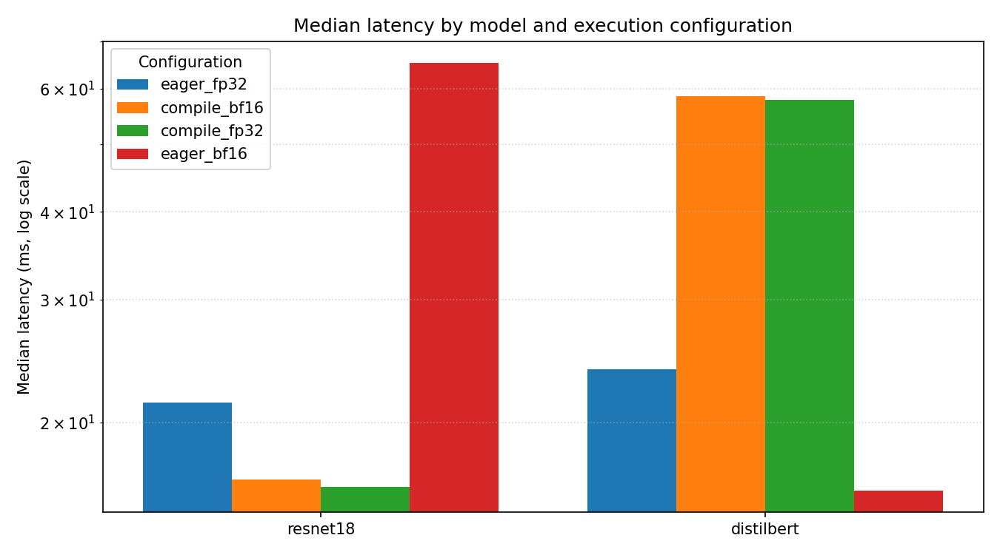
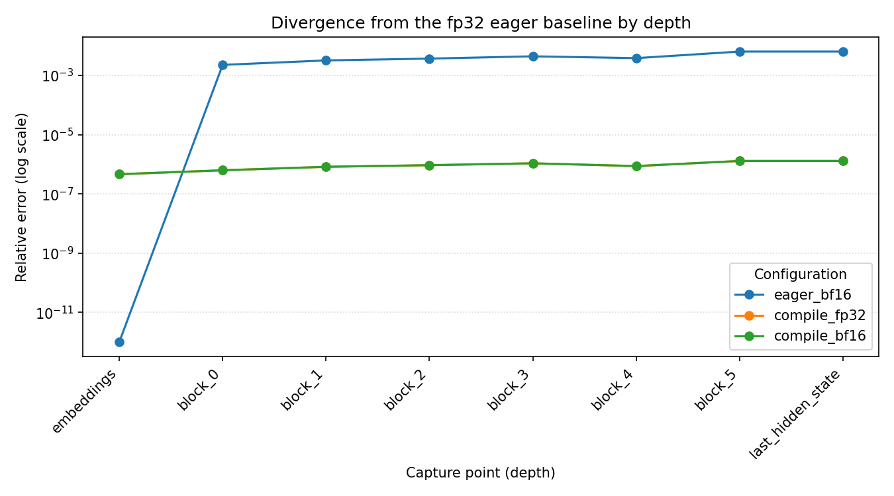

# Findings and experimentation

This document records the experiments run with the harness and what they show. The
[README](../README.md) summarises the takeaways; the full narrative, tables, and the
investigation behind the headline finding are here. See [methodology.md](methodology.md)
for how the numbers are measured.

## Setup

All results below were produced on a single machine:

- **Hardware:** Apple M3 Pro, 12 logical cores. CPU and MPS (Metal) backends. No CUDA.
- **Software:** Python 3.11, PyTorch 2.12, torchvision 0.27, with seed 1234. The latency and
  validation tables below were produced with Transformers 4.57.6; the project now pins
  Transformers 5.0.0rc3, and the one result that differs between the two is called out
  explicitly where it appears.
- **Models:** torchvision ResNet-18 (convolutional, vision) and Hugging Face DistilBERT
  (transformer, text), batch size 8.
- **Configurations:** `eager_fp32` (baseline), `eager_bf16`, `compile_fp32`, `compile_bf16`.
- **Measurement:** 5 warmup iterations, then 8 repeat blocks of 20 timed iterations each.

Absolute latency and memory depend on the host, so the numbers below are illustrative.
They should not be compared against results from a different machine; the comparisons
within a single run, and the relative behaviour across configurations, are what carry
over.

One finding is library-version sensitive, and that is itself instructive. The DistilBERT
compiled fp32 substitution described below reproduces with Transformers 4.57.6 but not with
the pinned 5.0.0rc3, because the 5.0 attention refactor changes the graph that the compiler
sees. The ResNet-18 substitution does not depend on Transformers and reproduces under both.
A numerical check that is rerun on every dependency change is exactly what surfaces this
kind of drift.

## Latency

### CPU


| Model      | Config         | Median (ms) | p90 (ms) | Throughput (items/s) |
| ---        | ---            | ---:        | ---:     | ---:                 |
| resnet18   | `eager_fp32`   | 51.25       | 55.44    | 156.1                |
| resnet18   | `compile_fp32` | 47.04       | 47.70    | 170.1                |
| resnet18   | `compile_bf16` | 246.99      | 264.45   | 32.4                 |
| resnet18   | `eager_bf16`   | 1422.25     | 1566.37  | 5.6                  |
| distilbert | `eager_fp32`   | 48.36       | 50.49    | 165.4                |
| distilbert | `compile_fp32` | 46.79       | 47.34    | 171.0                |
| distilbert | `compile_bf16` | 254.71      | 263.80   | 31.4                 |
| distilbert | `eager_bf16`   | 253.85      | 262.74   | 31.5                 |

Observations:

- **Eager bf16 on CPU is very slow.** For ResNet-18 it is about 28 times slower than fp32
  (1422 ms versus 51 ms). The bf16 elementwise and convolution kernels on this CPU are
  not optimised, so reduced precision costs rather than saves time.
- **Compilation recovers, and slightly beats, fp32 speed** (`compile_fp32` is the fastest
  CPU configuration for both models).
- **bf16 is only worth compiling.** `compile_bf16` is far faster than `eager_bf16` but
  still slower than either fp32 configuration on CPU.

### MPS



| Model      | Config         | Median (ms) | p90 (ms) | Throughput (items/s) |
| ---        | ---            | ---:        | ---:     | ---:                 |
| resnet18   | `eager_fp32`   | 21.38       | 23.59    | 374.2                |
| resnet18   | `compile_fp32` | 16.18       | 18.17    | 494.3                |
| resnet18   | `compile_bf16` | 16.58       | 18.82    | 482.6                |
| resnet18   | `eager_bf16`   | 65.32       | 90.51    | 122.5                |
| distilbert | `eager_fp32`   | 23.85       | 26.67    | 335.5                |
| distilbert | `compile_fp32` | 57.75       | 64.06    | 138.5                |
| distilbert | `compile_bf16` | 58.53       | 63.42    | 136.7                |
| distilbert | `eager_bf16`   | 15.99       | 17.12    | 500.4                |

Observations:

- **MPS roughly doubles eager fp32 throughput over CPU** (ResNet-18 51 ms to 21 ms,
  DistilBERT 48 ms to 24 ms).
- **Compilation helps the vision model and hurts the transformer.** `compile_fp32` is the
  fastest ResNet-18 configuration, but for DistilBERT compilation is about 2.4 times
  slower than eager (58 ms versus 24 ms). torch.compile is not a universal speed-up;
  whether it pays off is model and backend dependent, which is exactly why a benchmark
  matrix is worth running rather than assuming.
- **The fastest DistilBERT configuration on MPS is `eager_bf16`**, the opposite of CPU.

## Numerical validation

### CPU: everything within tolerance

| Model      | Config         | Max abs diff | Mean abs diff | Cosine  | Top-5 agree | Status |
| ---        | ---            | ---          | ---           | ---     | ---         | ---    |
| resnet18   | `compile_fp32` | 4.530e-06    | 6.608e-07     | 1.00000 | 1.000       | PASS   |
| resnet18   | `compile_bf16` | 4.133e-02    | 7.786e-03     | 0.99999 | 0.950       | PASS   |
| resnet18   | `eager_bf16`   | 3.026e-02    | 5.986e-03     | 0.99999 | 0.950       | PASS   |
| distilbert | `compile_fp32` | 4.172e-06    | 2.874e-07     | 1.00000 | 1.000       | PASS   |
| distilbert | `compile_bf16` | 3.740e-02    | 1.926e-03     | 0.99998 | 0.990       | PASS   |
| distilbert | `eager_bf16`   | 1.312e-02    | 1.842e-03     | 0.99998 | 0.990       | PASS   |

On CPU, compiled fp32 is numerically identical to eager fp32 to within floating-point
noise (about 1e-6), and bf16 diverges as expected but preserves direction and ranking.

### MPS: compiled fp32 fails the fp32 tolerance

The table below is the Transformers 4.57.6 result. The DistilBERT rows change under the
pinned 5.0.0rc3; that change is the subject of the version note that follows.

| Model      | Config         | Max abs diff | Mean abs diff | Cosine  | Top-5 agree | Status |
| ---        | ---            | ---          | ---           | ---     | ---         | ---    |
| resnet18   | `compile_fp32` | 3.507e-02    | 6.338e-03     | 0.99999 | 0.975       | FAIL   |
| resnet18   | `compile_bf16` | 3.507e-02    | 6.338e-03     | 0.99999 | 0.975       | PASS   |
| resnet18   | `eager_bf16`   | 3.507e-02    | 6.338e-03     | 0.99999 | 0.975       | PASS   |
| distilbert | `compile_fp32` | 1.201e-02    | 1.785e-03     | 0.99998 | 0.994       | FAIL   |
| distilbert | `compile_bf16` | 1.201e-02    | 1.785e-03     | 0.99998 | 0.994       | PASS   |
| distilbert | `eager_bf16`   | 2.823e-02    | 1.877e-03     | 0.99998 | 0.991       | PASS   |

`compile_fp32` fails on both models because its absolute difference from the fp32 eager
baseline is far larger than fp32 should produce. The bf16 configurations show the same
divergence but pass, because the bf16 tolerance expects it.

**Version note (Transformers 5.0.0rc3).** Under the pinned version the DistilBERT
`compile_fp32` and `compile_bf16` rows no longer fail: their max absolute difference from
the fp32 eager baseline drops from `1.201e-02` to `5.96e-06`, which passes the fp32
tolerance. The ResNet-18 rows are unchanged, because they do not depend on Transformers.
The cause is the 5.0 attention refactor, detailed in the headline section below.

## Headline finding: torch.compile on MPS computes fp32 in reduced precision

The MPS validation table shows a suspicious pattern: for each model, `compile_fp32` and
`compile_bf16` report exactly the same divergence. That is not what a genuine fp32 path
would do. The following experiment isolates the cause by running independent models and
comparing the raw outputs.

```
eager_fp32 (run twice)            max abs diff: 0.0          (deterministic)
CPU fp32   vs MPS eager_fp32      max abs diff: 7.6e-06      (agree: MPS eager fp32 is correct)
MPS eager_fp32 vs MPS compile_fp32 max abs diff: 0.0350695   (compiled fp32 diverges)
MPS eager_fp32 vs MPS eager_bf16   max abs diff: 0.0350695   (same divergence as bf16)
MPS compile_fp32 == MPS eager_bf16: True                     (bit-identical)
```

The conclusion is unambiguous:

- MPS **eager** fp32 matches CPU fp32 to 7.6e-6: the eager path is genuinely
  full precision.
- MPS **compiled** fp32 output is **bit-identical to bf16** and diverges from eager fp32
  by about 0.035.

In other words, `torch.compile` on the MPS backend computes a nominally full-precision
configuration in reduced precision. A user who selects `compile_fp32` for accuracy on MPS
does not get the precision they asked for.

The harness flags this as a tolerance violation on MPS, which is the intended behaviour.
A configuration that claims fp32 but does not deliver it is exactly the class of issue
numerical validation exists to catch, and it is invisible to a latency benchmark alone.
The cosine similarity remains 0.99999 and top-k agreement remains high, so the outputs
are directionally fine; whether the precision loss matters depends on the application,
which is why the harness reports the magnitude rather than only a pass or fail.

The experiment above was run with Transformers 4.57.6, the version under which both models
exhibit the substitution.

### Version sensitivity: the DistilBERT substitution depends on the attention path

The substitution is a property of the MPS compiler backend, not of any one model, but
whether a given model triggers it depends on the exact operations the compiler is handed.
Upgrading to the pinned Transformers 5.0.0rc3 makes this concrete:

```
MPS eager_fp32 vs MPS compile_fp32, resnet18    max abs diff: 0.0350695   (still diverges)
MPS compile_fp32 == MPS eager_bf16, resnet18    True                      (still bit-identical)
MPS eager_fp32 vs MPS compile_fp32, distilbert  max abs diff: 5.96e-06    (now full precision)
```

- **ResNet-18 is unchanged.** It does not depend on Transformers, so the convolutional
  compiled path still computes fp32 in reduced precision and still fails validation.
- **DistilBERT no longer diverges.** Transformers 5.0 replaced `DistilBertSdpaAttention`
  with `DistilBertSelfAttention` dispatched through the unified `sdpa` interface. The
  compiled graph that results no longer triggers the substitution, so compiled fp32 now
  matches eager fp32 to about `6e-6` and passes validation.

The headline holds for the backend and for the convolutional model; for the transformer it
held under one library version and not the next. That a dependency bump silently moved a
configuration from failing to passing, with no code change, is precisely the drift a
numerical check rerun on every change exists to surface. It is also why the tables above
are version stamped rather than presented as timeless.

## Divergence localisation: where reduced precision enters and how it propagates

The validation above compares only final outputs. Localisation captures activations at
eight depth boundaries (the embedding output, the six transformer block outputs, and the
final hidden state) and asks where divergence from the fp32 eager baseline first appears.
The runs below are on MPS with a first-divergence threshold of `1e-3`. See
[divergence-localisation.md](divergence-localisation.md) for the capture mechanism and the
metric definitions.



The `compile_fp32` and `compile_bf16` lines overlap exactly, near floating-point noise;
the `eager_bf16` line is the only one that diverges. The reasons are different in each
case and are the substance of this section.

### eager_bf16: divergence enters at the first block and amplifies with depth

This curve is identical under Transformers 4.57.6 and 5.0.0rc3. Autocast bf16 arithmetic
does not depend on the attention refactor, so the eager reduced-precision result is stable
across the upgrade and is the version-independent core of this section.

| Capture point       | Max abs diff | Mean abs diff | Cosine   | Relative error |
| ---                 | ---          | ---           | ---      | ---            |
| `embeddings`        | 0.000e+00    | 0.000e+00     | 1.000000 | 0.000e+00      |
| `block_0`           | 1.541e-02    | 1.097e-03     | 0.999997 | 2.275e-03      |
| `block_1`           | 1.371e-02    | 1.717e-03     | 0.999995 | 3.219e-03      |
| `block_2`           | 1.769e-02    | 2.057e-03     | 0.999993 | 3.706e-03      |
| `block_3`           | 4.505e-02    | 2.781e-03     | 0.999990 | 4.425e-03      |
| `block_4`           | 3.303e-01    | 2.859e-03     | 0.999993 | 3.846e-03      |
| `block_5`           | 2.823e-02    | 1.877e-03     | 0.999981 | 6.406e-03      |
| `last_hidden_state` | 2.823e-02    | 1.877e-03     | 0.999981 | 6.406e-03      |

First divergence is `block_0`. The embedding output is bit-identical to the baseline,
because autocast leaves the embedding lookup and its layer norm in fp32; reduced precision
first bites at `block_0`, the first block whose matrix multiplications run in bf16, at a
relative error of `2.3e-3`.

From there the relative error grows with depth to `6.4e-3` at the final hidden state, an
amplification of about 2.8 times, though not strictly monotonically: it dips at `block_4`.
The maximum absolute difference tells a sharper story about the layer norm boundaries. A
worst-case element grows to `4.5e-2` at `block_3` and `3.3e-1` at `block_4`, and then the
`block_5` output layer norm pulls it back to `2.8e-2`. The per-block layer norm therefore
resets the worst-case outlier, but it does not stop the normalised error from climbing:
the divergence is genuinely propagated and amplified through depth, which is exactly the
behaviour a per-layer view exists to expose and a final-output comparison hides.

### compile_fp32 and compile_bf16: the probe-effect contrast, and what it reveals across versions

The hooked per-layer curve for both compiled configurations sits at floating-point noise at
every depth, and is identical under both library versions:

| Capture point       | Relative error (hooked) |
| ---                 | ---                     |
| `embeddings`        | 4.636e-07               |
| `block_0`           | 6.286e-07               |
| `block_1`           | 8.252e-07               |
| `block_2`           | 9.359e-07               |
| `block_3`           | 1.082e-06               |
| `block_4`           | 8.728e-07               |
| `block_5`           | 1.299e-06               |
| `last_hidden_state` | 1.299e-06               |

A flat noise-level curve cannot, on its own, distinguish a configuration that is genuinely
faithful from one whose divergence the hooks have suppressed. That is why a compiled target
also runs one un-hooked whole-model pass, and the report records the probe-effect contrast
between the hooked and un-hooked final divergence. The contrast is exactly what separates
the two library versions:

```
Transformers 4.57.6   compile_fp32   hooked: 5.96e-06    un-hooked: 1.20e-02
Transformers 5.0.0rc3  compile_fp32   hooked: 5.96e-06    un-hooked: 5.96e-06
```

- **Under 4.57.6 the contrast is large.** Hooks report `6e-6` while the un-hooked model
  diverges by `1.2e-2`. Capturing an intermediate activation forces a graph break that
  suppresses the reduced-precision substitution. The substitution is a property of the
  fully fused whole-graph compilation, so it cannot be attributed to any one block: the
  moment a probe reads a block boundary, it is gone. This is the observer effect described
  in the methodology, and it is why the flat hooked curve above is not evidence of fidelity
  under that version.
- **Under 5.0.0rc3 the contrast vanishes.** Hooked and un-hooked both read `6e-6`. There is
  no substitution to suppress, consistent with the version note in the headline section:
  the 5.0 attention refactor removed it. The same flat curve now does mean what it appears
  to mean.

The mechanism earns its place precisely because the flat curve looks the same in both
cases. Without the un-hooked probe the report could not tell a suppressed substitution from
a genuinely faithful path, and a reader would draw the wrong conclusion under 4.57.6. The
faithful `eager_bf16` curve above shows, for contrast, what reduced-precision propagation
looks like when it is directly observable rather than dissolved by the act of observing.

## Regression detection example

To illustrate a detected regression, an 18 percent slowdown was injected into one
configuration of a copy of a run, then compared against the original as baseline:

| Model      | Config         | Baseline ms | Current ms | Delta  | p-value | Effect | Status     |
| ---        | ---            | ---:        | ---:       | ---:   | ---:    | ---:   | ---        |
| resnet18   | `eager_fp32`   | 51.17       | 51.17      | +0.0%  | 0.521   | +0.00  | PASS       |
| resnet18   | `compile_bf16` | 248.32      | 248.32     | +0.0%  | 0.521   | +0.00  | PASS       |
| resnet18   | `compile_fp32` | 47.09       | 47.09      | +0.0%  | 0.521   | +0.00  | PASS       |
| resnet18   | `eager_bf16`   | 1441.46     | 1441.46    | +0.0%  | 0.521   | +0.00  | PASS       |
| distilbert | `eager_fp32`   | 48.23       | 48.23      | +0.0%  | 0.521   | +0.00  | PASS       |
| distilbert | `compile_bf16` | 254.36      | 254.36     | +0.0%  | 0.521   | +0.00  | PASS       |
| distilbert | `compile_fp32` | 46.75       | 55.17      | +18.0% | 0.000   | +1.00  | REGRESSION |
| distilbert | `eager_bf16`   | 253.80      | 253.80     | +0.0%  | 0.521   | +0.00  | PASS       |

Only the affected configuration is flagged. The unchanged configurations report a
p-value of 0.521 and zero effect size, well short of both the significance threshold and
the relative margin.

## Caveats

- Numbers are single-machine and host dependent. Treat them as relative, not absolute.
- The MPS finding is specific to this PyTorch version and backend; it is the kind of
  behaviour that can change between releases, which is itself an argument for running the
  validation continuously.
- On shared CI runners, performance regression detection is report-only because latency
  variance between runs is several-fold. See [ci-and-artifacts.md](ci-and-artifacts.md) for
  the gating rationale.
